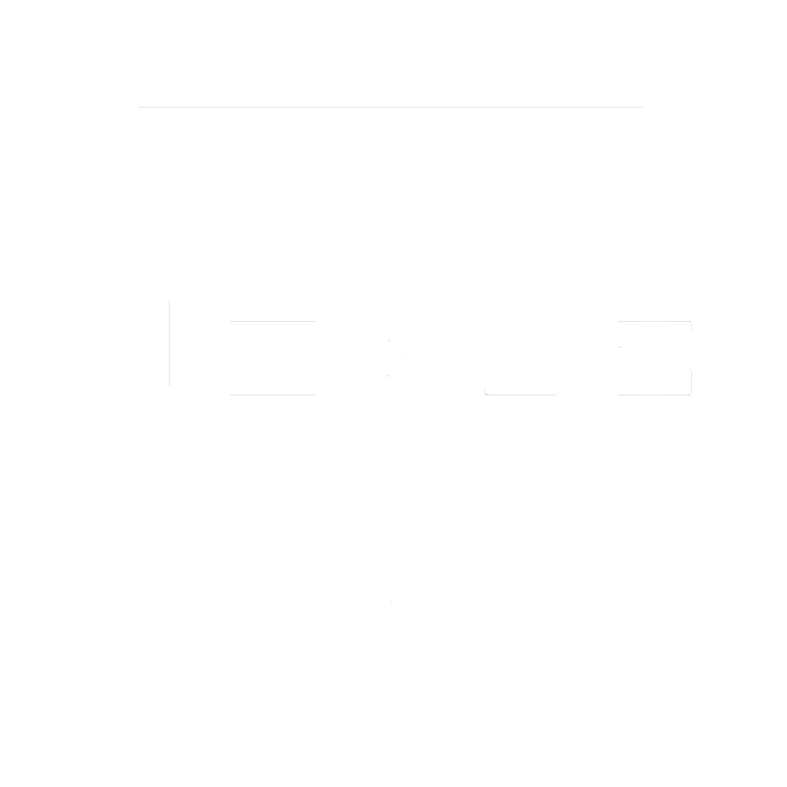

<h1 align="center">

</h1>
<h4 align="center">Nexus is an electron powered, SciFi terminal, designed to be usable while also providing awesomeness.</h4>

 

## Features include:

- Custom Themes and Layouts
- Spotify Integration
- ICAL Calendar Integration
- CPU and Network Stats
- Docker Stats
- Audio Feedback and SFX
- And much more!

## Screenshots

Screenshots of themes can be seen below. Each theme is defined in a json file, and can be added to the app via drag and drop. 

All themes are using the default layout, however, custom layouts can also be defined (for example, to place the terminal at the bottom of the screen, or remove/add certain modules).

